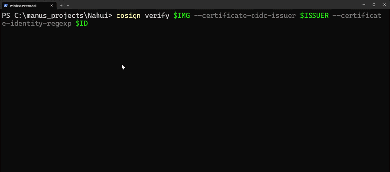
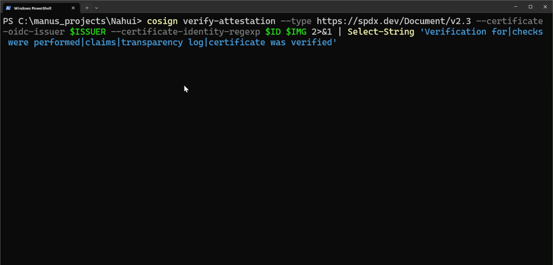
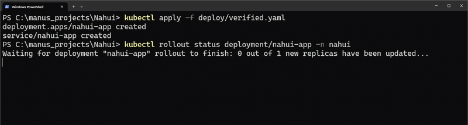
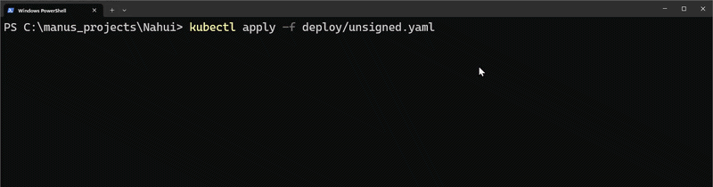

<pre align="center">
          ██████╗
          ╚═════╝
███╗   ██╗ █████╗ ██╗  ██╗██╗   ██╗██╗
████╗  ██║██╔══██╗██║  ██║██║   ██║██║
██╔██╗ ██║███████║███████║██║   ██║██║
██║╚██╗██║██╔══██║██╔══██║██║   ██║██║
██║ ╚████║██║  ██║██║  ██║╚██████╔╝██║
╚═╝  ╚═══╝╚═╝  ╚═╝╚═╝  ╚═╝ ╚═════╝ ╚═╝
</pre>
<p align="center">
  <strong>Nāhui — software supply chain security.</strong><br>
  <em>Build-to-deploy chain of custody: signed, attested, and verified — or it doesn't run.</em>
</p>

## What is Nahui?

I named it after **Nahui** (Nāhui), the Nahuatl word for *four* — the foundational ordering principle in Mexica cosmology, the number of directions, of pillars, of the cycles that hold the world together. I built it on **four pillars of supply chain trust**:

1. **Know what's in it** — Software Bill of Materials (SBOM)
2. **Prove it wasn't swapped** — cryptographic signing (Sigstore)
3. **Prove how it was built** — build provenance (SLSA)
4. **Refuse anything unverified** — admission-time enforcement

An artifact that can't satisfy all four never runs.

> Companion to [Bastión Xólot](#) — where Xólotl guards the network gateway, Nahui guards the supply chain.

---

## The Problem

Modern software is *assembled*, not written. A single container image can pull in hundreds of transitive dependencies and build tools — each one an attack surface. The last few years made this concrete:

| Incident | What was attacked |
|---|---|
| **SolarWinds** (2020) | The *build process* — malicious code injected during build, not in source |
| **Log4Shell** (2021) | A single transitive dependency exposed millions of services |
| **xz/liblzma backdoor** (2024) | A multi-year social-engineering attack on a maintainer nearly backdoored mainstream Linux |

The defensive answer the industry and regulators converged on — pushed into federal procurement by US Executive Order 14028 — is **supply chain integrity**: SBOM, provenance, signing, and *enforcement at deploy time*. I built Nahui as a working reference implementation of exactly that.

---

## Architecture

```
  Developer
     │  git push (signed commit)
     ▼
┌──────────────────────────────────────────────────────────┐
│  CI Pipeline  (GitHub Actions, hardened runner)           │
│                                                           │
│  1. Build app + container image                           │
│  2. Generate SBOM             → Syft (SPDX / CycloneDX)   │
│  3. Scan SBOM for vulns       → Grype  (fail on critical) │
│  4. Sign image + SBOM         → cosign / Sigstore         │
│  5. Generate SLSA provenance  → slsa-github-generator     │
│  6. Record in transparency log → Rekor                    │
│  7. Push image + attestations → OCI registry              │
└──────────────────────────────────────────────────────────┘
     │  image + .sig + .att + SBOM
     ▼
┌──────────────────────────────────────────────────────────┐
│  Kubernetes  (kind / k3s)                                 │
│                                                           │
│  Admission controller verifies BEFORE scheduling:         │
│    • signature valid + trusted identity (keyless OIDC)    │
│    • SLSA provenance attestation present + valid          │
│    • SBOM attestation attached                            │
│    • image digest-pinned (no :latest)                     │
│                                                           │
│  ✅ Verified   → pod runs                                 │
│  ❌ Unverified → admission DENIED                         │
└──────────────────────────────────────────────────────────┘
```

---

## The Four Pillars → Threat Model

Each pillar exists to defeat a specific attack class.

| # | Pillar | Tool | Attack it defeats | Residual risk |
|---|---|---|---|---|
| 1 | **SBOM** | Syft + Grype | Unknown/vulnerable dependencies, transitive CVEs (Log4Shell) | SBOM only as good as the scanner's data; zero-days unknown at build time |
| 2 | **Signing** | cosign / Sigstore + Rekor | Image substitution, registry tampering, MITM | Trust roots must be managed; compromised signing identity |
| 3 | **Provenance** | slsa-github-generator (in-toto) | Build-system tampering (SolarWinds-class) | Trust in the CI platform's isolation guarantees |
| 4 | **Enforcement** | Kyverno / Sigstore policy-controller | Running unsigned/unattested/`:latest` images | Misconfigured policy = bypass; cluster RBAC must be sound |

---

## Tech Stack

| Layer | Tool |
|---|---|
| SBOM generation | **Syft** (SPDX + CycloneDX) |
| Vulnerability scan | **Grype** |
| Signing | **cosign / Sigstore** (keyless OIDC) |
| Transparency log | **Rekor** |
| Provenance | **slsa-github-generator** (target: SLSA Build L3) |
| Attestation envelope | **in-toto** |
| Admission control | **Kyverno** or **Sigstore policy-controller** |
| Orchestration | **kind / k3s** |
| CI/CD | **GitHub Actions** |

---

## Demo

```bash
# 1. Push a commit → pipeline builds, scans, signs, attests, pushes
git push

# 2. Verify the artifact end-to-end
cosign verify <image>
cosign verify-attestation --type slsaprovenance <image>

# 3. Deploy the VERIFIED image → it runs
kubectl apply -f deploy/verified.yaml      # ✅ pod scheduled

# 4. Deploy an UNSIGNED image → admission denied
kubectl apply -f deploy/unsigned.yaml      # ❌ DENIED by policy
```

The two deploys above are the test: the verified image runs, the unsigned one is refused at admission.

### Seeing it work

**Verify the artifact came from the pipeline** — the signature, then the SBOM and provenance attestations:





**Enforce it at the cluster** — the verified image is admitted and runs:



An untrusted image (a normal public nginx) is denied before it can schedule:



---

## Roadmap

- [x] **Phase 1** — Baseline app + naive (insecure) pipeline
- [x] **Phase 2** — SBOM generation + vuln scanning, gate on critical CVEs
- [x] **Phase 3** — cosign keyless signing + Rekor transparency entries
- [x] **Phase 4** — SLSA provenance attestation (target Build L3)
- [x] **Phase 5** — Admission control: verify signature + provenance + SBOM before scheduling
- [x] **Phase 6** — Threat model write-up + architecture diagram + demo recording

### Stretch

- [ ] Runtime detection with **Falco** fed a simulated attack
- [ ] Same admission policy in **Kyverno vs. OPA Gatekeeper** + tradeoff write-up
- [ ] **VEX** documents to suppress non-exploitable CVE noise
- [ ] **Vault** for build-time secrets

---

## Why this exists

I built Nahui to demonstrate my fluency in the current software supply chain security stack — Sigstore, SLSA, SBOM, and policy-as-code enforcement — across the full SDLC: build → scan → sign → attest → enforce.

## License

MIT
