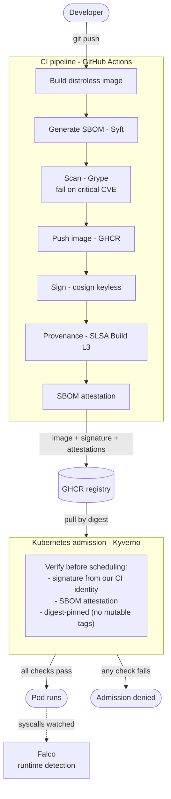

# Architecture

This is the per-component detail behind the design — the diagram below, then
what each piece does and why I built it that way.

## Diagram

## Components

| Component | Path | Pillar | Phase |
|---|---|---|---|
| Baseline app | `cmd/nahui-app`, `internal/server` | (the artifact) | 1 |
| Container build | `Dockerfile` | — | 1 |
| CI pipeline | `.github/workflows/ci.yml` | all | 1→5 |
| SBOM + scan | Syft + Grype (in CI) | 1 (SBOM) | 2 |
| Signing | cosign keyless (in CI) | 2 | 3 |
| Provenance + attestations | SLSA + cosign/GitHub (in CI) | 3 | 4 |
| Admission policy | `policies/verify-images.yaml` | 4 (enforce) | 5 |
| Deploy manifests + cluster scripts | `deploy/`, `scripts/` | — | 5 |

## Flow

The path an artifact takes from my keyboard to a running pod:

1. **Build** — `nahui-app` compiles to a static binary, packaged into a
   distroless image with the build version baked in via `-ldflags`.
2. **Describe** — Syft generates an SPDX SBOM from the image.
3. **Scan** — Grype gates the build, failing on critical CVEs.
4. **Push** — the scanned image goes to GHCR; the registry digest is captured.
5. **Sign** — cosign keyless-signs the digest and the entry lands in Rekor.
6. **Attest** — SLSA build provenance (GitHub's native attestations, Build L3)
   and the SBOM are attached to the digest. The SBOM is also published as a
   cosign-format attestation so an admission controller can verify it.
7. **Enforce** — at admission, Kyverno verifies the signature, the SBOM
   attestation, and digest-pinning before the pod is allowed to schedule.

A note on provenance: it's generated and publicly verifiable (cosign /
`gh attestation verify`), but I verify it out-of-cluster rather than at
admission. GitHub's provenance is non-falsifiable Build L3 because GitHub's
control plane generates it; re-issuing it as an in-job cosign attestation just
so Kyverno could read it would be a weaker, self-attested copy. So the cluster
verifies signature + SBOM, and provenance is checked in the supply chain.

Past admission, Falco watches the running workloads at the syscall level and
flags suspicious behavior live (see [runtime detection](runtime-detection.md)),
adding a runtime layer on top of the build-time controls.

## Design choices

- **Go + distroless** — a static binary keeps the SBOM and attack surface as
  small as possible, so what I'm attesting to is my code, not a base image full
  of packages.
- **Keyless (OIDC) signing** — no long-lived keys to manage or leak; signing
  runs against the CI's OIDC identity instead.
- **Digest pinning enforced at admission** — mutable tags are a policy failure,
  not just a convention. If it isn't pinned by digest, it doesn't run.
- **Sign-and-scan before push** — the image is built and scanned locally in the
  runner first; a critical CVE fails the build before anything reaches the
  registry.
