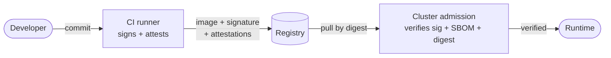

# Threat Model

> This maps each pillar to the attack class it defeats and the residual risk I'm
> knowingly leaving on the table. It'll grow as the implementation lands.

## Scope

The thing being defended is the path from source commit to running workload:
build, SBOM, scan, sign, provenance, attestation, and admission-time
enforcement. Runtime behavior is also watched now, via Falco
([docs](runtime-detection.md)), so a workload that's compromised after it's
admitted can still be caught in the act. Out of scope (on purpose): a compromise
of my own dev machine.

## Trust boundaries

| Boundary | What crosses it | Control |
|---|---|---|
| Dev → CI | source commit | signed commits (stretch) |
| CI → registry | image + attestations | cosign signing, SLSA provenance |
| Registry → cluster | image by digest | admission policy verification |

Each arrow is a place an attacker could substitute or tamper with the artifact.
The controls make those substitutions detectable: a swapped image fails
signature verification, a tampered build fails provenance, and an image that
never went through the pipeline has no SBOM attestation to present.

## Pillars → attacks (see README for the summary table)

| Pillar | Attack class it defeats | Residual risk |
|---|---|---|
| SBOM (Syft/Grype) | unknown / vulnerable deps (Log4Shell) | scanner data lag; build-time zero-days |
| Signing (cosign/Rekor) | image substitution, registry tampering | signing-identity compromise; trust-root mgmt |
| Provenance (SLSA) | build-system tampering (SolarWinds) | trust in CI isolation |
| Enforcement (Kyverno) | running unsigned/`:latest` images | policy misconfig; cluster RBAC |

## What's enforced where

Being precise about where each check actually happens, since it matters for the
threat model:

| Check | Where it runs | What it stops |
|---|---|---|
| Critical-CVE gate | CI, before push | a known-vulnerable image ever reaching the registry |
| Signature (keyless) | CI signs, **cluster verifies** | running an image not built by this pipeline |
| SBOM attestation | CI attests, **cluster verifies** | running an image whose bill of materials isn't from our build |
| Digest pinning | **cluster** | mutable-tag swaps (`:latest` pointing somewhere new) |
| SLSA provenance | CI attests, **verified out-of-cluster** | build-system tampering — checked via cosign/`gh`, not at admission |

## Assumptions

Worth calling out, because each one is a place the model could break down:

- The CI platform's OIDC identity is the root of build trust.
- Rekor's transparency log is available and trustworthy.
- Cluster RBAC stops anyone from bypassing the admission webhook.
- The Sigstore trust roots (Fulcio/Rekor) the cluster verifies against are sound.

## Open questions

Still on my list to work out:

- Key/identity rotation.
- VEX handling to suppress non-exploitable CVE noise (stretch).
- Build-time secret management with Vault (stretch).
